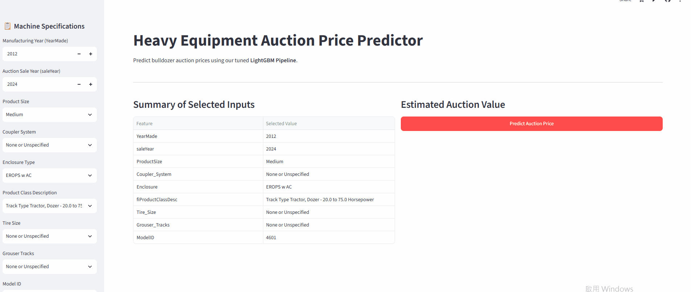

# Equipment Sales Price Prediction

## Overview
This project tackles a complex regression problem by constructing a robust machine learning pipeline to forecast heavy machinery sales prices. By leveraging rigorous chronological data splitting, feature engineering, and high-performance gradient boosting models, the pipeline tries to accurately capture market pricing trends over time.


> For in-depth details for Exploratory Data Analysis (EDA), Model Selection and Tuning, and Results, please refer to the [Full Technical Report](bulldozers_price_report.md).

---

## Demo



**Try the Live Interactive Web App:** [Heavy Equipment Auction Price Predictor on Streamlit Cloud](https://bulldozers-price-predictor-p5ljxqbywgdqmwqej7vsix.streamlit.app)

---

## Key Features & Highlights

* **Chronological Data Integrity:** Implements strict temporal sorting and splitting of training and validation datasets to prevent data leakage and accurately simulate real-world forecasting constraints.

* **Granular Feature Engineering:** Extracts rich temporal attributes (saleYear, saleMonth, saleDay, saleDayofweek, saleDayofyear) from raw timestamps to capture underlying seasonal and cyclical market trends.

* **Optimized Gradient Boosting Models:** Leverages high-performance algorithms like LightGBM, paired with systematic hyperparameter tuning to minimize prediction error.

* **Interactive Web Deployment:** Integrated with an intuitive Streamlit Cloud application, allowing users to interactively test predictions and explore model outputs in real time.

---
## Key Results  

### 1. Model Performance Comparison

We evaluated the baseline and tuned candidate models across multiple metrics to analyze predictive accuracy and generalization performance.

<p align="center">
  
</p>

* **Best Model Performance:** **Tuned LightGBM** emerged as the clear champion, achieving the lowest Validation RMSLE of **0.2071**, the lowest Validation MAE of **\$5,092.09**, and the highest $R^2$ Score of **0.9205**.

* **Impact of Hyperparameter Tuning:** Tuning significantly improved LightGBM's metrics compared to its baseline variant, outperforming both baseline and tuned stacking approaches.

### 2. Feature Importance & Model Interpretability

To understand the mechanics behind the Tuned LightGBM model, we utilized SHAP (SHapley Additive exPlanations) to analyze global feature importance and feature impact distributions.

<p align="center">
  
</p>

* **Top Predictive Drivers:** `num__YearMade` (manufacturing year) and `cat__ProductSize` emerge by far as the most dominant drivers of equipment pricing, with older machines and smaller sizes heavily shifting valuations.

* **Temporal and Spec Impact:** Temporal indicators like `num__saleYear` alongside categorical structural attributes (such as `cat__Coupler_System` and `cat__Enclosure`) play secondary yet vital roles in fine-tuning price adjustments.

* **Non-Linear Dynamics:** The SHAP beeswarm distribution clearly highlights non-linear feature interactions, showing how high versus low values across numerical and encoded categorical features scale the model's final auction price output.

---

## Tech Stack

* **Language:** Python `3.12.11`
* **Data Processing & Analysis:** Pandas, NumPy
* **Machine Learning:** Scikit-Learn, lightgbm
* **Visualization:** Matplotlib, Seaborn, statsmodels
* **Model Interpretability :** shap
* **Model Persistence:** Joblib
* **Web Framework:** Streamlit

---

## Project Structure

```text
bulldozers-price-predictor/
├── assets/
│   └── demo.gif                        # Demonstration GIF for README
├── data/                               # Data set
├── bulldozers_price_regression.ipynb   # Complete Machine Learning pipeline
├── bulldozers_price_report.md          # Comprehensive technical report
├── app.py                              # Interactive Streamlit web application
├── requirements.txt                    # Python dependencies
└── README.md                           # Project documentation
```

The execution pipeline automatically generates and manages the following runtime directories:

```text
├── models/             # Stores trained model files
└── plots/              # Generated visualizations
    ├── EDA/            # Exploratory Data Analysis plots
    ├── Tuning/         # Hyperparameter tuning and 
    ├── Evaluation      # Evaluation Metrics
    └── Features/       # Feature importance visualizations
```

---

## How to Run

First clone the repository:
```bash
git clone https://github.com/BevisWong76/bulldozers-price-predictor.git
cd bulldozers-price-predictor
```

You can then set up the project locally using either the standard Python `venv` or the ultra-fast `uv` package manager.

### Option 1: Using Standard Python `venv` (Traditional)

1. Create a virtual environment:
```bash
python -m venv .venv
```

2. Activate the virtual environment:
```bash
# Windows (Command Prompt):
.venv\Scripts\activate.bat

# Windows (PowerShell):
.venv\Scripts\Activate.ps1

# macOS / Linux:
source .venv/bin/activate
```

3. Install dependencies:
```bash
pip install --upgrade pip
pip install -r requirements.txt
```

### Option 2: Using `uv` (Recommended for Speed)

`uv` is an extremely fast Python package installer and resolver written in Rust.

1. Install `uv` (if you haven't already):
```bash
pip install uv
```

2.  Create a virtual environment:

```bash
uv venv
```

3. Activate the virtual environment:
```bash
# Windows (Command Prompt):
.venv\Scripts\activate.bat

# Windows (PowerShell):
.venv\Scripts\Activate.ps1

# macOS / Linux:
source .venv/bin/activate
```

 4. Install dependencies:
```bash
uv pip install --upgrade pip
uv pip install -r requirements.txt
```

### Run the Streamlit App

Once the dependencies are installed and the model artifacts are generated, launch the interactive web application:

```bash
streamlit run app.py
```
---

## Acknowledgements

* **Dataset:** Heavy Equipment / Bulldozers Auction Dataset (inspired by Kaggle's Blue Book for Bulldozers).
* **Inspiration:** Built upon foundational concepts from the [Zero to Mastery Machine Learning Course](https://github.com/mrdbourke/zero-to-mastery-ml).

### Key Enhancements Beyond Baseline
* **Robust Pipeline Architecture:** End-to-end `Pipeline` workflows preventing data leakage and standardizing feature transformations.
* **Advanced Benchmarking & Tuning:** Comprehensive evaluation and hyperparameter tuning across LightGBM models.
* **Model Interpretability:** Deep-dive analysis using Permutation Importance and SHAP values.
* **Interactive Web App:** Production-ready prediction dashboard deployed via **Streamlit**.