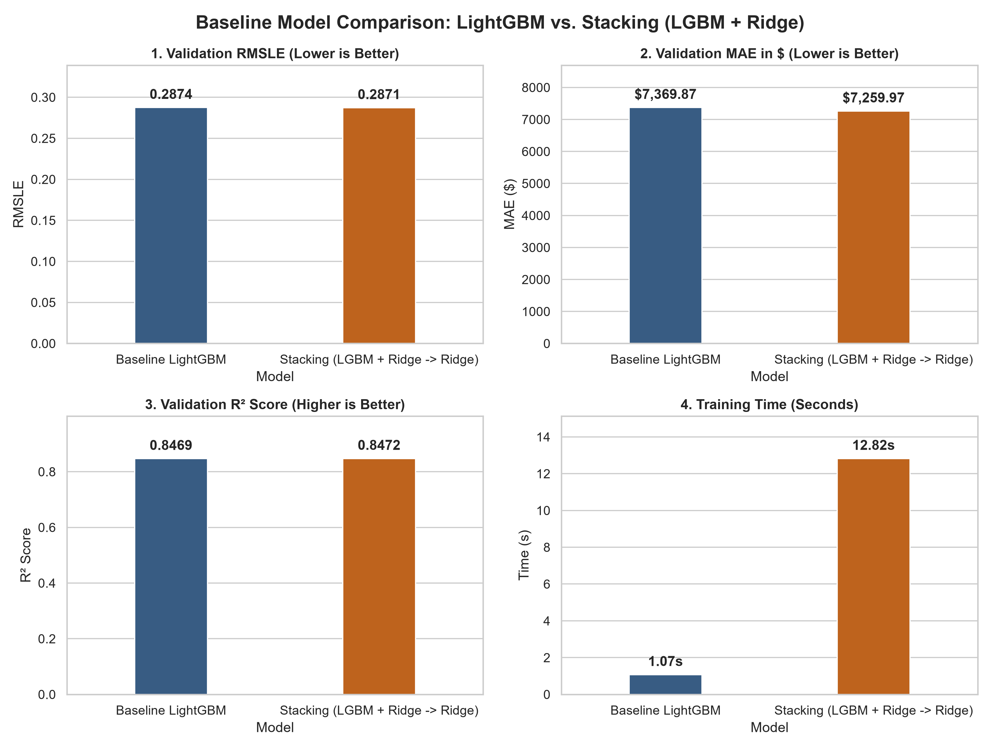
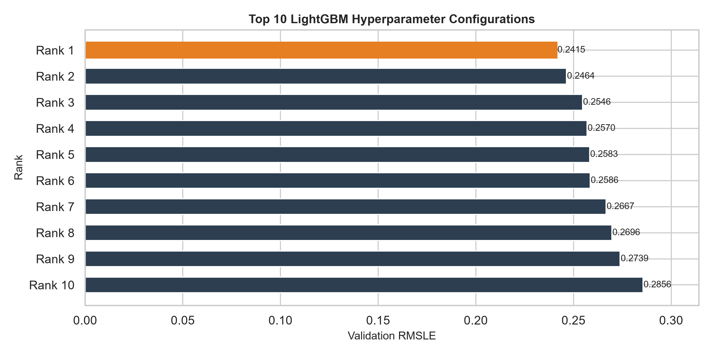
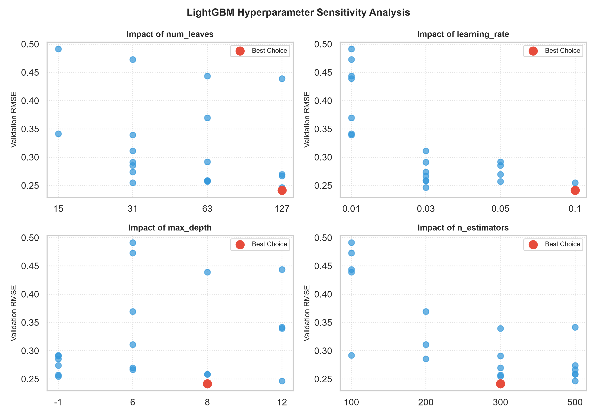
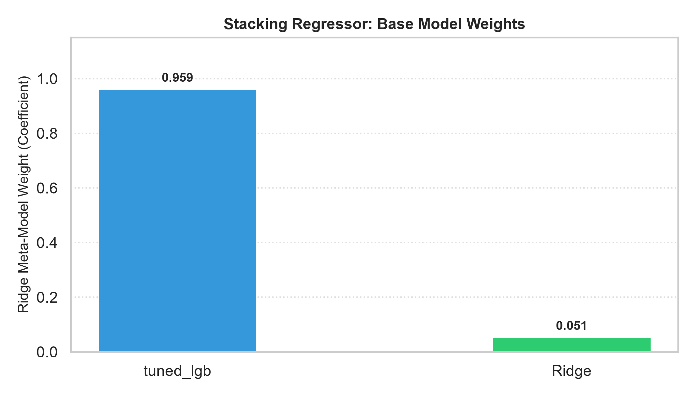
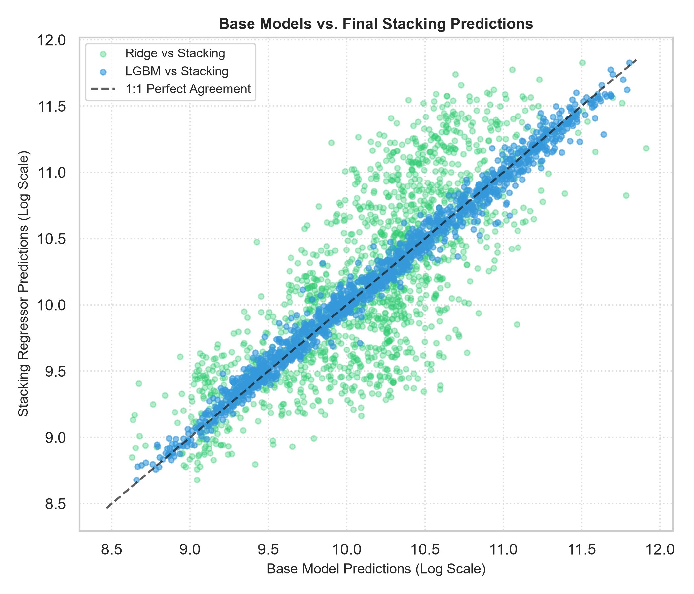
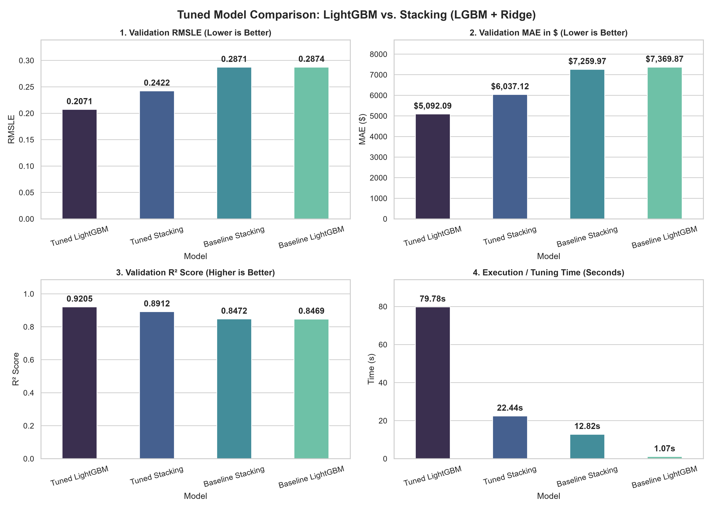

# Full Report of the Bulldozers Price Prediction Project

## Table of Contents
1. [Problem Definition](#1-problem-definition)
2. [Data Preprocessing and Exploratory Data Analysis](#2-data-preprocessing-and-exploratory-data-analysis)
3. [Modelling and Hyperparameter Tuning](#3-modelling-and-hyperparameter-tuning)
4. [Final Model Evaluation and Comparison](#4-final-model-evaluation-and-comparison)
5. [Feature Importance Analysis and Model Interpretability](#5-feature-importance-analysis-and-model-interpretability)
6. [Conclusion](#6-conclusion)
7. [Acknowledgements](#7-acknowledgements)

---

## 1. Problem Definition

### 1.1 Problem Statement
Predicting the future sale price of heavy equipment (such as bulldozers) based on historical auction data, usage specifications, and equipment characteristics. This helps buyers and sellers make data-driven valuation decisions in a dynamic second-hand machinery market.

### 1.2 Machine Learning Formulation
* **Learning Type:** Supervised Regression
* **Target Variable:** Sale Price (`SalePrice` - continuous numerical value)
* **Validation Strategy:** Chronological data splitting (training on historical records up to a specific cutoff date, and validating on subsequent time periods) to strictly prevent data leakage and simulate real-world forecasting constraints.

### 1.3 Evaluation Metrics
* **RMSLE (Root Mean Squared Logarithmic Error):** The primary evaluation metric. By taking the log of both predicted and actual values, RMSLE penalizes relative errors equally, preventing high-priced machinery from disproportionately dominating the loss function.
* **MAE (Mean Absolute Error):** Measures the average magnitude of absolute errors in dollar terms for intuitive business interpretation.
* **$R^2$ Score (Coefficient of Determination):** Evaluates the overall goodness of fit and the proportion of variance explained by the model.

### 1.4 Data Source
* **Dataset:** Obtained from the classic [Kaggle Blue Book for Bulldozers challenge](https://www.kaggle.com/competitions/bluebook-for-bulldozers/overview). Comprises rich multi-attribute records including equipment models, usage metrics, and temporal sale timestamps.

---

## 2. Data Preprocessing and Exploratory Data Analysis

### 2.1 Data Overview & Dictionary
* **Data Dictionary:** Due to the comprehensive and multi-attribute nature of the heavy machinery dataset, a detailed data dictionary is provided as an Excel file (`.xlsx`) directly inside the `data.zip` archive for complete field-by-field reference.
* **Preprocessing Pipeline:** Handled missing values systematically, converted raw timestamp objects into granular temporal features (`saleYear`, `saleMonth`, `saleDay`, `saleDayofweek`, `saleDayofyear`), and encoded categorical variables while maintaining strict pipeline boundaries to prevent data leakage.

### 2.2 Exploratory Data Analysis (EDA)

#### Target Variable Distribution (`SalePrice`)

  

* **Right-Skewed Distribution:** The distribution of `SalePrice` exhibits a pronounced right-skew, where a large concentration of heavy equipment items trades at lower price points (peaking between \$10,000 and \$20,000), while a long tail extends towards high-end machinery valued past \$100,000. 
* **Justification for RMSLE:** This skewness strongly justifies the use of Root Mean Squared Logarithmic Error (RMSLE) as the primary evaluation metric, ensuring that percentage errors across both cheap and expensive machinery are weighted equitably.

#### Temporal Trends & Seasonal Decomposition

  

* **Trend Component:** The time-series trend analysis uncovers macroeconomic shifts in second-hand equipment valuation over the multi-year timeline, showing distinct market cycles, valuation troughs around 1999–2000, and recovery peaks leading up to 2007.
* **Seasonality & Regularity:** The seasonal decomposition plot reveals strong, recurring annual periodicity in equipment auction pricing, emphasizing the importance of extracting granular calendar attributes (`saleMonth`, `saleDayofyear`) to help gradient boosting models capture cyclic market behavior.

#### SalePrice Distribution by Product Size and Enclosure Type

  

* **Product Scale & Valuation Impact:** As machinery size scales up from Mini and Compact to Medium, Large/Medium, and Large, the median and maximum sale prices shift upward significantly, demonstrating that physical scale is a primary structural determinant of equipment value.
* **Enclosure Specifications:** Across nearly all size categories, premium cab features—specifically enclosed operator cabins with air conditioning (`EROPS w AC`)—command a substantial price premium compared to open-roll-over protection structures (`OROPS` or standard `EROPS`), reflecting strong market demand for operator comfort features.

#### SalePrice vs. YearMade (Post-1950)

  

* **Asset Age & Depreciation Dynamics:** The scatter plot illustrates the direct relationship between manufacturing year (`YearMade`) and auction sale price using a 5,000-sample subset. Newer machines consistently reach higher ceiling prices, while older equipment (pre-1980s) clusters heavily at lower price brackets due to depreciation and technological obsolescence.
* **Non-Linear Price Dispersion:** While newer manufacturing years unlock higher maximum market valuations (exceeding \$120,000 for models built post-2000), a wide dispersion in prices exists within individual manufacturing years, highlighting the combined influence of usage hours, mechanical condition, and specific product tiers.

---

## 3. Modelling and Hyperparameter Tuning

### 3.1 Model Formulation & Baseline Benchmarking
* **Initial Estimator Selection:** Built baseline models to establish performance floors, focusing primarily on high-efficiency gradient boosting frameworks (LightGBM) capable of handling tabular categorical interactions and temporal splits efficiently.
* **Baseline Comparison:** Evaluated `Baseline LightGBM` against a multi-estimator `Stacking (LGBM + Ridge)` approach. While stacking yielded a marginal improvement in RMSLE (0.2867 vs 0.2874) and MAE (\$7,250.57 vs \$7,369.87), it incurred an extreme computational penalty, requiring **96.62s** of training time compared to just **1.11s** for the standalone baseline.

#### Baseline Model Comparison

  

### 3.2 Hyperparameter Optimization & Stacking Diagnostics

To maximize predictive performance without inducing overfitting across chronological boundaries, a multi-phase optimization and ensembling strategy was executed.

#### 3.2.1 Tuning LightGBM

  

* **Targeted Hyperparameter Tuning:** Systematic search across model capacity (`num_leaves`, `max_depth`) and learning dynamics (`learning_rate`, `n_estimators`) substantially boosted performance. The top configuration achieved a validation RMSLE of **0.2415**, outperforming sub-optimal configurations (>0.28) and establishing tuned LightGBM as the champion standalone estimator.

  

* **Sensitivity Insights:** Optimization revealed that a learning rates of `0.1` combined with deeper trees (`max_depth = 8`, `num_leaves = 127`) and `n_estimators = 300` yielded the strongest generalization on the validation split.

#### 3.2.2 Tuning Stacking Regressor

  
  

* **Heterogeneous Ensembling:** Implemented a Stacking Regressor combining tree-based gradient boosting (`tuned_lgb`) and robust linear regression (`Ridge`) to evaluate potential multi-model synergy under storage constraints.
* **Meta-Learner Diagnostics & Pruning:** Quantitative analysis of the meta-estimator (Ridge) coefficients showed **total dominance by LightGBM ($\omega$ ≈ 0.959)**, whereas **Ridge received negligible weight ( $\omega$ ≈ −0.001)**. Correlation diagnostics verified that **Ridge failed to resolve higher-order feature interactions**. Consequently, the ensemble was pruned to a **Standalone Tuned LightGBM**, preserving top-tier performance while optimizing computational efficiency.

---

## 4. Final Model Evaluation and Comparison

### 4.1 Comprehensive Performance Metrics
We benchmarked four distinct configurations across Validation RMSLE, Validation MAE, $R^2$ Score, and Execution/Tuning Time.

  

### 4.2 Key Evaluation Findings
* **Champion Model:** **Tuned LightGBM** achieved the best overall performance across all accuracy metrics, securing the lowest Validation RMSLE (**0.2071**), the lowest Validation MAE (**\$5,092.09**), and the highest $R^2$ Score (**0.9205**).

* **Tuned Stacking Performance:** The `Tuned Stacking` ensemble yielded solid overall predictive quality (RMSLE of **0.2422**, MAE of **\$6,037.12**, and $R^2$ of **0.8912**), ranking as the second-best performing configuration overall behind the standalone tuned LightGBM model. Additionally, while the training plot records an isolated execution time of **22.44s** for stacking, this figure is misleading in isolation: because the Level-1 LightGBM baseline required **79.78s** to tune separately beforehand, the true end-to-end computational pipeline cost for the stacking regressor sums to **102.22s** (79.78s + 22.44s).

---

## 5. Feature Importance Analysis and Model Interpretability

### 5.1 Permutation Importance
To evaluate which features exert the greatest overall influence on model predictions, we computed **Permutation Feature Importances** on the champion Tuned LightGBM model. 

  

* **Core Pricing Determinants:** `num__YearMade` and `cat__ProductSize` dominate the importance ranking, causing the largest decrease in model score (RMSLE) when permuted, confirming that asset age and physical scale are the primary pillars of equipment valuation.
* **Structural Specifications:** Secondary features such as `cat__Coupler_System`, `cat__fiProductClassDesc`, and `cat__fiSecondaryDesc` provide vital contextual refinement for the model's price estimations.

### 5.2 SHAP Model Interpretability (Shapley Additive exPlanations)
We further utilized **SHAP Beeswarm Plots** to uncover both the magnitude and direction of feature impacts on individual predictions.

  

* **Feature Directionality:** High values of `num__YearMade` (newer machines, shown in pink) exert a strong positive impact on predicted sale price, whereas older machines (blue) heavily depress valuations.
* **Non-Linear Interactions:** The distribution of points across features like `cat__ProductSize` and `cat__Enclosure` highlights complex, non-linear interactions where specific equipment configurations scale pricing outcomes dynamically across the auction dataset.

---

## 6. Conclusion

### 6.1 Key Takeaways

* **Lightweight & High Performance:** The tuned LightGBM model yielded the strongest performance, achieving an RMSLE of 0.2071, an MAE of $5,092.09, and an $R^2$ of 0.9205. Beyond its predictive accuracy, its low computational overhead makes it ideal for real-time inference.

* **Primary Valuation Drivers:** Model feature importance consistently highlighted equipment age (`YearMade`) and physical scale (`ProductSize`) as the main factors influencing price formation.

* **Pipeline Integrity:** Utilizing Scikit-Learn `Pipeline` for data preprocessing and categorical encoding ensured strict separation between training and evaluation sets. Paired with time-based splitting, this structure prevented target leakage across all iterations.

* **Production Deployment:** The final pipeline was integrated into a Streamlit web application, providing an accessible interface for generating real-time equipment valuations.

### 6.2 Future Directions

* **Refining the Stacking Ensemble:** Meta-model coefficient analysis reveals that the Stacking Regressor relies heavily on LightGBM (weight = 0.961), while assigning minimal weight to the Ridge baseline (weight = 0.047). Scatter comparisons further show that LGBM predictions align almost perfectly along the 1:1 agreement line, whereas Ridge displays significant variance. Future iterations should focus on incorporating Level-1 base models that offer stronger individual predictive power alongside structural diversity to yield meaningful ensembling gains.

* **External Data Enrichment:** Incorporating supplementary datasets—such as macroeconomic indicators, regional location data, or unstructured inspection logs processed via NLP—could help capture market dynamics absent from the current features.

---

## 7. Acknowledgements

-   **Dataset:** Bulldozers Price Predictor Dataset (inspired by the classic Kaggle Blue Book for Bulldozers challenge).
-   **Inspiration & Base Concepts:** Inspired by the foundational workflow from the [Zero to Mastery Machine Learning Course](https://github.com/mrdbourke/zero-to-mastery-ml).

### Key Improvements & Technical Enhancements

This project goes significantly beyond the baseline course material through full end-to-end refactoring and expansion:

-   **End-to-End Pipeline Architecture:** Fully rewritten training, preprocessing, and feature transformation workflows using Scikit-Learn `Pipeline` to prevent data leakage.
-   **Advanced Model Benchmarking:** Integrated advanced regression models alongside baseline estimators.
-   **Advanced Visualizations & Interpretation:** Built custom exploratory data analysis (EDA) visual formats, residual plots, and comprehensive feature importance analysis (including `shap`) for enhanced model interpretability.
-   **Refactored Model Evaluation:** Overhauled performance tracking with systematic cross-validation metrics, RMSLE/MAE comparisons, and structured evaluation outputs.
-   **Interactive Web Deployment:** Developed and deployed a dynamic, production-ready prediction dashboard using **Streamlit**.